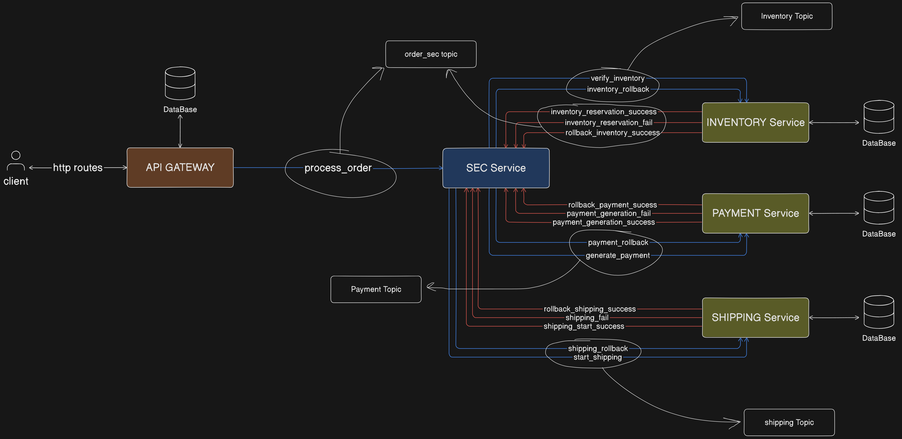

# Simple GO REST API with Gin and Kafka events

This is an API built with the Go programming language, the Gin web framework and Kafka to stream events. The purpose of this project is to learn the basic concepts of building a RESTful API using Go, Gin and Kafka Events in SAGA pattern.

## Table of Contents

- [Installation](#installation)
- [Usage](#usage)
- [API Endpoints](#api-endpoints)
- [Running the Application](#running-the-application)
- [Building the Application](#building-the-application)
- [Contributing](#contributing)
- [License](#license)

## Installation

To run this project, you need to have Go installed on your machine. You can download it from the [official Go website](https://golang.org/dl/).

### Steps

1. Clone the repository:
   ```bash
   git clone https://github.com/MrRique15/go_rest_api.git
   ```
2. Change into the project directory:
   ```bash
   cd go_rest_api
   ```
3. Install the dependencies:
   ```bash
   go mod tidy
   ```

## SAGA Pattern

The SAGA pattern is a way to manage distributed transactions. It is a sequence of local transactions where each transaction updates the database and publishes a message or event to trigger the next transaction in the sequence. If one of the transactions fails, the SAGA pattern uses compensating transactions to undo the changes made by the preceding transactions.

You can check the SAGA pattern implementation in this project by checking the [inventory_service](inventory_service) and [main_api](main_api) folders.
Also, you can check the Diagram of the SAGA pattern implementation in the image below: 


## Usage

To start the server, run the following command:

```bash
cd main_api
go run main.go
```

The server will start on `http://localhost:8080`.

## API Endpoints

To check the API endpoints, you can access the [routes documentation](routes_doc/README.md).

## Testing the Application

To test the application, execute the following command:

```bash
cd main_api
go test -v
```

It will run all tests that has been set in files like *_test.go

## Running Kafka and Zookeeper with Docker

To run Kafka and Zookeeper with Docker, execute the following command:

```bash
cd kafka
docker-compose up
```

## Configuring Kafka Topics

To create the necessary topics for the application automaticaly, execute the following command:

```bash
cd kafka
./create_topics.sh
```

## Running Inventory Service

The inventory service will watch for new orders by consuming the `inventory` topic from kafka, triggered by Saga Execution Controller and then it will update items stock and order status.
If the item is out of stock, it will send a message to the Saga Execution Controller to cancel the order, using the `inventory` topic.
On the other hand, if the item is in stock, it will send a message to the Saga Execution Controller to proceed with the order, using the `inventory` topic.

```bash
cd inventory_service
go run main.go
```

## Building the API Gateway

To run build the API Gateway, execute the following command:

```bash
cd main_api
go build
```
And then run it by executing the right command for your OS:

### Windows
```bash
cd main_api
.\main_api.exe
```

### Linux
```bash
cd main_api
./main_api
```

This will start the API server on port 8080. You can use tools like [Postman](https://www.postman.com/) or `curl` to interact with the API.

## Contributing

Contributions are welcome! Please open an issue or submit a pull request if you have any suggestions or improvements.

## License

This project is licensed under the MIT License. See the [LICENSE](LICENSE) file for details.
